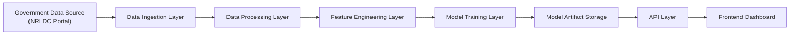
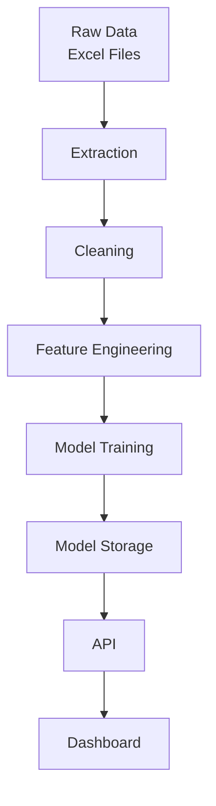
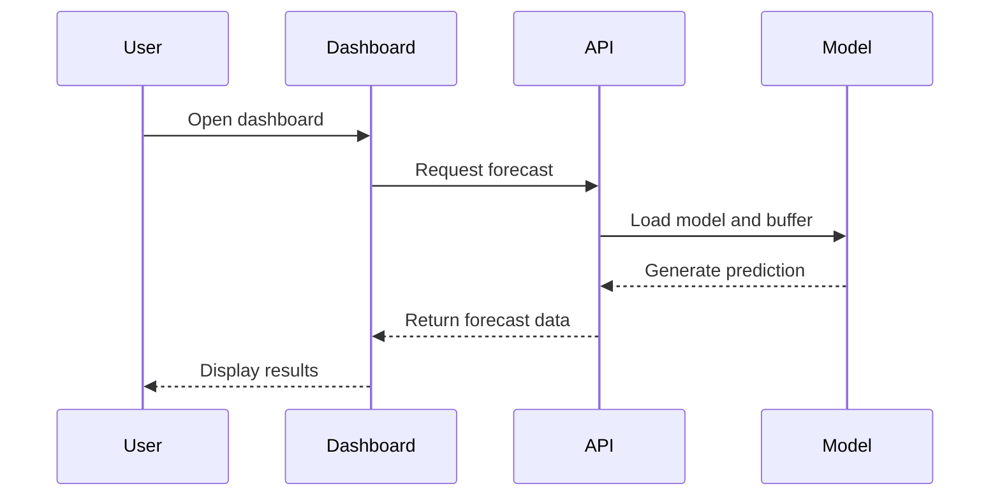

# System Architecture

## Overview

GridCast follows a layered, pipeline-driven architecture designed for real-world electricity demand forecasting. The system separates concerns into distinct layers:

- Data Ingestion
- Data Processing
- Modeling
- Serving
- Visualization

This ensures scalability, maintainability, and ease of extension.

---

## High-Level Architecture



---

## Layered Architecture Breakdown

### 1. Data Source Layer

Source:

- NRLDC (Government Electricity Portal)

Characteristics:

- Real-world data
- Semi-structured (Excel files)
- Time-series format (15-minute intervals)

---

### 2. Data Ingestion Layer

Component: Scraper

Responsibilities:

- Automates file download
- Handles pagination and dynamic UI
- Organizes raw data

Output:

- data/raw/<year>/<month>/*.xlsx

---

### 3. Data Processing Layer

Split into two stages:

#### Extraction and Merging

- Parse Excel files
- Standardize schema
- Merge datasets

#### Cleaning and Validation

- Detect anomalies (spikes, outliers)
- Handle missing values
- Apply interpolation

Output:

- data/cleaned/nrldc_cleaned.parquet

---

### 4. Feature Engineering Layer

Transforms time-series into model-ready format:

- Lag features
- Rolling statistics
- Calendar-based features

This converts sequential data into structured input for ML models.

---

### 5. Model Training Layer

Model: XGBoost

Responsibilities:

- Train on historical data
- Perform time-aware validation
- Generate evaluation metrics

---

### 6. Model Artifact Layer

Stores trained model and metadata:

```text
data/model/
├── xgboost_model.joblib
├── buffer.json
```

Includes:

- Model weights
- Feature configuration
- Evaluation metrics
- Residual diagnostics

---

### 7. API Layer

Framework: Flask

Endpoints:

- /health -> system status
- /forecast -> demand prediction
- /residuals -> error analysis

Key features:

- Loads model at startup
- Stateless request handling
- Low-latency inference

---

### 8. Visualization Layer

Component: Dashboard (HTML + JS)

Features:

- Forecast visualization
- KPI display
- Residual heatmap
- CSV export

Designed for operational decision support.

---

## Data Flow Architecture



---

## Runtime Interaction Flow



---

## Architectural Principles

### 1. Separation of Concerns

Each layer has a distinct responsibility:

Data to Processing to Model to Serving

### 2. Modular Design

- Independent components
- Easy to extend or replace modules

### 3. Artifact-Based Serving

- Model is pre-trained and stored
- No runtime retraining required

### 4. Scalability

- Can extend to multiple regions
- Can integrate real-time streaming

### 5. Observability

- Residual heatmap for error tracking
- Logs for ingestion and processing

---

## Current Limitations

- Batch-based pipeline (not real-time streaming)
- Single-region focus
- Dependency on external portal structure

---

## Future Architecture Enhancements

- Real-time streaming (Kafka or APIs)
- Multi-region distributed architecture
- Model registry and versioning
- Microservices-based deployment
- Monitoring and alerting systems

---

## Summary

The GridCast architecture is designed to:

- Handle real-world noisy data
- Provide reliable forecasting
- Enable scalable deployment

It transforms raw government data into actionable insights through a structured and production-ready pipeline.
