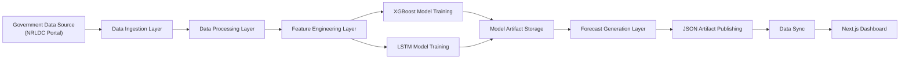
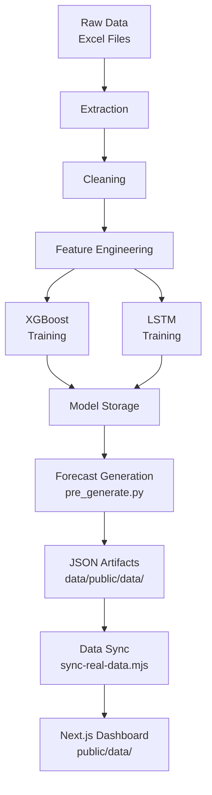
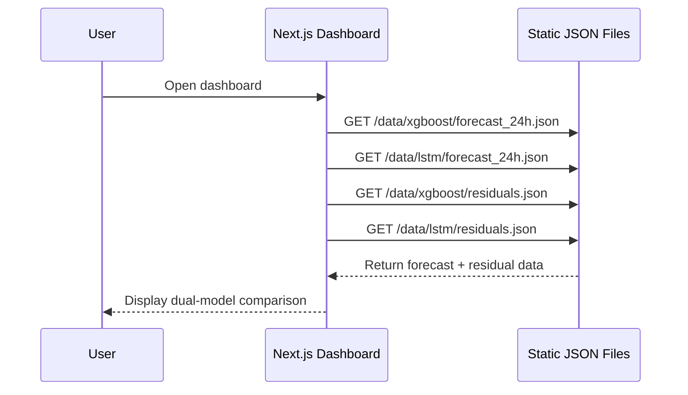
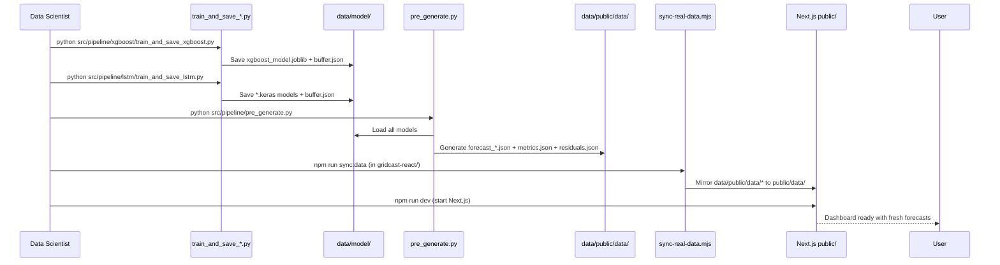

# System Architecture

## Overview

GridCast follows a layered, pipeline-driven architecture designed for real-world electricity demand forecasting. The system separates concerns into distinct layers:

- Data Ingestion
- Data Processing
- Feature Engineering
- Dual Model Training (XGBoost + LSTM)
- Forecast Artifact Generation
- Static Artifact Publishing
- Visualization

This ensures scalability, maintainability, ease of extension, and production-grade reliability.

---

## High-Level Architecture



---

## Layered Architecture Breakdown

### 1. Data Source Layer

Source:

- NRLDC (Government Electricity Portal)

Characteristics:

- Real-world data
- Semi-structured (Excel files)
- Time-series format (15-minute intervals)

---

### 2. Data Ingestion Layer

Component: Scraper

Responsibilities:

- Automates file download
- Handles pagination and dynamic UI
- Organizes raw data

Output:

- data/raw/<year>/<month>/*.xlsx

---

### 3. Data Processing Layer

Split into two stages:

#### Extraction and Merging

- Parse Excel files
- Standardize schema
- Merge datasets

#### Cleaning and Validation

- Detect anomalies (spikes, outliers)
- Handle missing values
- Apply interpolation

Output:

- data/cleaned/nrldc_cleaned.parquet

---

### 4. Feature Engineering Layer

Transforms time-series into model-ready format:

- Lag features (previous time steps)
- Rolling statistics (mean, std)
- Calendar-based features (hour, day, dayofweek, seasonality)

This converts sequential data into structured input for ML models.

---

### 5. Model Training Layer

Dual model approach for robust forecasting:

#### XGBoost Models
- Tree-based ensemble model
- Fast inference, interpretable feature importance
- Generates residuals for error diagnostics

#### LSTM Models  
- Deep learning sequence-to-sequence
- Separate models for 24h, 48h, 72h horizons
- Captures temporal dependencies and non-linear patterns

Both models train on historical data with time-aware validation split (seasonal holdout).

---

### 6. Model Artifact Storage Layer

Stores trained models and metadata:

```text
data/model/
├── xgboost/
│   ├── xgboost_model.joblib
│   └── buffer.json
└── lstm/
    ├── 24h.keras
    ├── 48h.keras
    ├── 72h.keras
    └── buffer.json
```

Includes:

- Model weights (joblib for XGBoost, .keras for LSTM)
- Feature configuration and scaler parameters
- Evaluation metrics and residual heatmaps
- Rolling buffer for recent data context

---

### 7. Forecast Generation Layer

Module: `src/pipeline/pre_generate.py`

Responsibilities:

- Load trained XGBoost and LSTM models
- Generate 24h, 48h, 72h forecasts
- Compute residual heatmaps
- Materialize predictions as JSON artifacts

Output:

```text
data/public/data/
├── xgboost/
│   ├── forecast_24h.json
│   ├── forecast_48h.json
│   ├── forecast_72h.json
│   ├── metrics.json
│   └── residuals.json
└── lstm/
    ├── forecast_24h.json
    ├── forecast_48h.json
    ├── forecast_72h.json
    ├── metrics.json
    └── residuals.json
```

---

### 8. JSON Artifact Publishing Layer

Static file-based serving:

- Pre-computed forecasts published as JSON files
- Metrics and residuals included in same artifacts
- No runtime inference required
- Enables reproducible and auditable forecasts
- Supports offline operation

Key features:

- Fast data access (no compute at query time)
- Deterministic outputs
- Easy to version and archive
- Integrates with static web hosting

---

### 9. Data Sync Layer

Module: `gridcast-react/scripts/sync-real-data.mjs`

Responsibilities:

- Mirror JSON artifacts from `data/public/data/` to frontend `public/data/`
- Validate presence of required files
- Enable Next.js to serve forecasts as static assets

---

### 10. Visualization Layer

Component: Next.js React Dashboard (`gridcast-react/`)

Features:

- Forecast visualization with dual model comparison
- KPI display (MAE, RMSE, MAPE)
- Residual heatmap (day-of-week × hour-of-day)
- Interactive region and load-profile selector
- CSV export of forecast data
- Authentication and role-based access control

Technology stack:

- **Framework**: Next.js 16+ with App Router
- **UI**: React 19 with TypeScript
- **Styling**: Tailwind CSS
- **Charts**: ApexCharts for time-series and heatmaps
- **Auth**: NextAuth.js for user management

Designed for operational decision support and grid planning.

---

## Data Flow Architecture



---

## Runtime Interaction Flow



## Training & Artifact Generation Flow



---

## Architectural Principles

### 1. Separation of Concerns

Each layer has a distinct responsibility:

Data → Extraction → Cleaning → Training → Generation → Publishing → Visualization

### 2. Modular Design

- Independent model implementations (XGBoost and LSTM)
- Easy to add new models or training strategies
- Decoupled frontend from backend via JSON contracts

### 3. Artifact-Based Serving (Deterministic)

- Models pre-trained offline
- Forecasts pre-generated and materialized as JSON
- No runtime retraining or inference required
- Enables reproducible, auditable predictions

### 4. Dual-Model Comparison

- Users see both XGBoost and LSTM predictions
- Helps build confidence through model consensus
- Enables ensemble strategies (weighted average, confidence bounds)

### 5. Observability & Diagnostics

- Residual heatmap for error pattern tracking
- Metrics (MAE, RMSE, MAPE) for each model and horizon
- Structured logs for ingestion, training, and generation
- JSON-based artifact versioning

### 6. Production Reliability

- Static file serving (no compute failures)
- Pre-validation of artifacts before deployment
- Offline-first architecture (works without live data)
- Easy rollback (previous JSON snapshots preserved)

---

## Current Limitations

- Batch-based pipeline (not real-time streaming) — forecasts pre-computed daily
- Single-region focus (North region / NRLDC)
- Dependency on NRLDC portal structure stability
- Static JSON artifacts (no dynamic re-forecasting on request)
- File-based deployment model (not containerized)

---

## Future Architecture Enhancements

- Real-time streaming (Kafka or event-driven APIs)
- Multi-region distributed architecture (SRLDC, WRLDC, ERLDC)
- Model registry and versioning (MLflow integration)
- Containerized deployment (Docker, Kubernetes)
- Monitoring and alerting systems (Prometheus, Grafana)
- Hybrid ensemble models (XGBoost + LSTM ensemble combiner)
- Automated retraining pipeline with scheduler
- A/B testing framework for model updates
- GraphQL API for flexible data queries

---

## Summary

The GridCast architecture is designed to:

- Handle real-world noisy data
- Provide reliable forecasting
- Enable scalable deployment

It transforms raw government data into actionable insights through a structured and production-ready pipeline.
