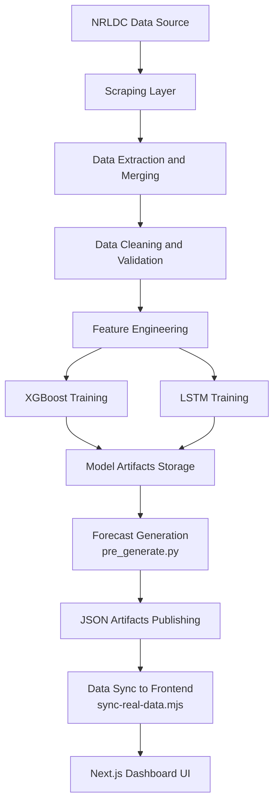
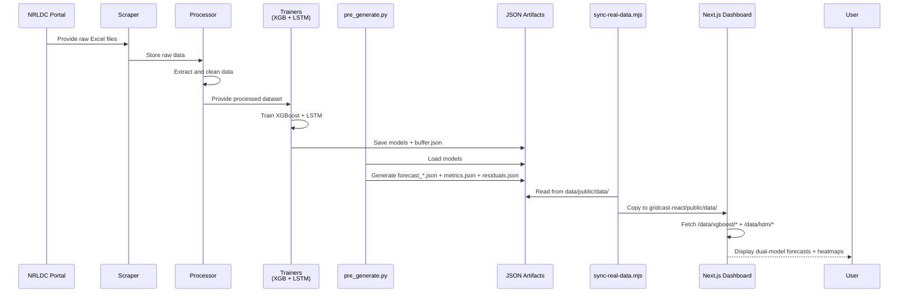

# System Design

## Overview

GridCast is designed as a modular, end-to-end forecasting system for electricity demand prediction. The architecture follows a pipeline-based approach with dual model training (XGBoost + LSTM) and JSON artifact-based serving, ensuring:

- Scalability and modularity
- Maintainability with clear separation of concerns
- Production-grade reliability through pre-computed forecasts
- Deterministic, auditable prediction outputs
- Easy offline operation and deployment

The system transforms raw government data into actionable forecasts through structured processing stages, materializes them as JSON artifacts, and visualizes them through a modern Next.js dashboard.

---

## Design Goals

- **End-to-end automation**: Raw data → processed dataset → trained models → JSON forecasts → dashboard
- **Robust data handling**: Reliable spike/anomaly detection and interpolation
- **Deterministic serving**: Pre-computed forecasts (no runtime variability)
- **Dual-model strategy**: Compare XGBoost (fast, interpretable) vs LSTM (adaptive, deep-learned)
- **Operational observability**: Residual analysis and error diagnostics
- **Modular extensibility**: Easy to add new models or retrain strategies
- **Offline resilience**: Forecasts available even without live data connections

---

## High-Level Architecture



---

## System Components

### 1. Data Ingestion Layer

Module: src/scrapping/scrap_excel.py

Responsibilities:

- Automates download of electricity data from NRLDC portal
- Handles pagination and dynamic web elements
- Organizes raw files by year and month

Output:

- data/raw/<year>/<month>/*.xlsx

---

### 2. Data Processing Layer

#### Extraction and Merging

Module: src/ingestion/data_merger.py

- Parses Excel files
- Extracts relevant columns (timestamp, demand)
- Merges multiple files into a unified dataset

Output:

- data/extracted/nrldc_extracted.parquet

#### Data Cleaning and Validation

Module: src/ingestion/data_cleaning.py

- Detects anomalies (spikes, unrealistic values)
- Handles missing values
- Applies interpolation
- Ensures time-series consistency

Output:

- data/cleaned/nrldc_cleaned.parquet

---

### 3. Feature Engineering Layer

Module: `src/pipeline/xgboost/train_and_save_xgboost.py`, `src/pipeline/lstm/train_and_save_lstm.py`

Transforms raw time-series into model-ready features:

- **Lag features**: Previous time steps (1, 2, 4, 8, 12, 24 steps)
- **Rolling statistics**: Mean, std, min, max over windows
- **Calendar features**: Hour, day-of-week, month, seasonality (sin/cos encoded)
- **Trend features**: Rate of change, accumulated change

This converts time-series into a structured learning problem suitable for tree-based and deep-learning models.

---

### 4. Model Training Layer

Dual model approach for robust forecasting:

#### 4a. XGBoost Training

Module: `src/pipeline/xgboost/train_and_save_xgboost.py`

Properties:

- **Fast**, interpretable, gradient-boosted trees
- **Single model** handles all horizons (24h, 48h, 72h)
- **Training strategy**: Time-aware split with seasonal holdout
- **Evaluation**: MAE, RMSE, MAPE metrics
- **Inference**: Direct point predictions
- **Output**: Forecast residuals for heatmap analysis

#### 4b. LSTM Training

Module: `src/pipeline/lstm/train_and_save_lstm.py`

Properties:

- **Deep learning** sequence-to-sequence model
- **Separate models** for each horizon (24h, 48h, 72h)
- **Architecture**: Stacked LSTM layers with dropout regularization
- **Training strategy**: Auto-regressive with teacher forcing
- **Evaluation**: Same metrics as XGBoost
- **Scaling**: MinMaxScaler per horizon for stability
- **Output**: Forecast residuals for heatmap analysis

#### Why Dual Models?

- **Ensemble robustness**: Consensus improves reliability
- **Coverage**: XGBoost handles linear/seasonal patterns; LSTM captures non-linear dynamics
- **Interpretability**: XGBoost feature importance aids debugging
- **Adaptability**: LSTM learns from recent patterns; XGBoost from long history
- **User confidence**: Side-by-side comparison builds trust

---

### 5. Model Artifact Layer

Stores trained models and metadata:

```text
data/model/
├── xgboost/
│   ├── xgboost_model.joblib          # Trained XGBoost regressor
│   └── buffer.json                    # Metadata, scaler, residual heatmap
└── lstm/
    ├── 24h.keras                      # LSTM for 24-hour horizon
    ├── 48h.keras                      # LSTM for 48-hour horizon
    ├── 72h.keras                      # LSTM for 72-hour horizon
    └── buffer.json                    # Metadata, scalers, residual heatmap
```

Contents of buffer.json:

- **Feature configuration**: Column names and order
- **Scaling metadata**: MinMaxScaler bounds (for LSTM)
- **Model metrics**: Train/test MAE, RMSE, MAPE per horizon
- **Rolling buffer**: Recent 336 historical points (7 days)
- **Residual heatmap**: Pre-computed error patterns (day-of-week × hour-of-day)
- **Timestamp tracking**: Last training run time

This enables stateless, reproducible forecast generation.

---

### 6. Forecast Generation Layer

Module: `src/pipeline/pre_generate.py`

Responsibilities:

1. **Load models**: Import trained XGBoost and LSTM artifacts
2. **Prepare context**: Extract recent 7-day rolling buffer from cleaned data
3. **Generate forecasts**:
   - **For XGBoost**: Single forward pass with lag/rolling/calendar features
   - **For LSTM**: Auto-regressive generation: feed prediction back as input
4. **Scale predictions**: Inverse-scale LSTM outputs to original units
5. **Compute residuals**: Historical error patterns (day-of-week × hour-of-day)
6. **Materialize JSON**: Write forecast and diagnostic artifacts

Key algorithm:

```
For each horizon (24h, 48h, 72h):
  For XGBoost:
    - Build feature matrix with lagged data
    - Predict 24/48/72 steps directly
  For LSTM:
    - Seed with recent observations
    - Auto-regressive loop: feed each prediction as next input
    - Iterate horizon times to generate full sequence
  Compute residuals:
    - Load historical predictions vs actuals
    - Bin by hour-of-day and day-of-week
    - Store mean/std per bin
  Save to JSON:
    - Forecast data + metadata
    - Metrics (MAE, RMSE, MAPE)
    - Residuals heatmap
```

Output files (per model and horizon):

```text
data/public/data/xgboost/
├── forecast_24h.json               # 96 steps (24 hours × 15-min)
├── forecast_48h.json               # 192 steps
├── forecast_72h.json               # 288 steps
├── metrics.json                    # MAE/RMSE/MAPE per horizon
└── residuals.json                  # Heatmap: hour × day-of-week

data/public/data/lstm/
├── forecast_24h.json
├── forecast_48h.json
├── forecast_72h.json
├── metrics.json
└── residuals.json
```

---

### 7. JSON Artifact Publishing Layer

Method: Static file-based serving

Artifacts (per model):

**forecast_24h.json** structure:

```json
{
  "model": "xgboost" or "lstm",
  "horizon": "24h",
  "generated_at": "2026-05-10T14:30:00Z",
  "data_end": "2026-05-10T10:00:00Z",
  "trained_at": "2026-05-09T03:20:00Z",
  "steps": 96,
  "forecast": [
    {"ts": "2026-05-10T10:15:00Z", "load_mw": 45230},
    {"ts": "2026-05-10T10:30:00Z", "load_mw": 45180},
    ...
  ]
}
```

**metrics.json** structure:

```json
{
  "model": "xgboost",
  "generated_at": "2026-05-10T14:30:00Z",
  "horizon_metrics": {
    "24h": {"mae": 1234.5, "rmse": 1456.2, "mape": 2.34},
    "48h": {"mae": 1567.3, "rmse": 1789.4, "mape": 2.89},
    "72h": {"mae": 1890.1, "rmse": 2123.5, "mape": 3.45}
  }
}
```

**residuals.json** structure:

```json
{
  "model": "xgboost",
  "generated_at": "2026-05-10T14:30:00Z",
  "heatmap_info": {"rows": 24, "cols": 7},
  "heatmap_matrix": [[error_val_00_mon, ...], ...],
  "heatmap_flat": [error_val_1, error_val_2, ...],
  "labels": {
    "hours": ["00:00", "00:15", ...],
    "days": ["Mon", "Tue", ...]
  }
}
```

Key advantages:

- **Reproducibility**: Same inputs always produce same outputs
- **Auditability**: Artifacts versioned and archived
- **Speed**: No runtime inference; instant retrieval
- **Reliability**: No compute failure; static files always available
- **Offline operation**: Works without live data connections
- **Easy rollback**: Previous JSON snapshots can be restored

### 8. Data Sync Layer

Module: `gridcast-react/scripts/sync-real-data.mjs`

Responsibilities:

1. **Mirror artifacts**: Copy JSON files from `data/public/data/` to Next.js `gridcast-react/public/data/`
2. **Validate presence**: Ensure all required files exist (5 per model = 10 files total)
3. **Preserve structure**: Maintain `xgboost/` and `lstm/` subdirectories
4. **Fail on missing**: Exit with error if files are incomplete

Usage:

```bash
cd gridcast-react
npm run sync:data
```

Integration with dev workflow:

```bash
# Full workflow: sync then dev server
npm run dev:real    # Runs: npm run sync:data && next dev

# Or manual:
npm run sync:data && npm run dev
```

Purpose:

- Bridges Python pipeline (`data/public/data/`) and Next.js frontend (`public/data/`)
- Enables hot-reload development: update Python artifacts, re-sync, dashboard refreshes
- Supports CI/CD automation: can be called after training scripts

### 9. Visualization Layer

Module: `gridcast-react/` (Next.js React app)

Features:

- **Forecast Charts**: Time-series plots for 24h, 48h, 72h horizons
- **Dual Model Comparison**: XGBoost vs LSTM side-by-side
- **KPI Display**: MAE, RMSE, MAPE for each model/horizon
- **Residual Heatmap**: Error patterns visualized as day-of-week × hour-of-day
- **Interactive Dashboard**: Region selector, load profile browser
- **Data Export**: CSV download of forecasts
- **Authentication**: NextAuth.js for role-based access
- **Real-time Refresh**: Auto-syncs fresh forecasts (polling or manual)

Technology:

- **Framework**: Next.js 16+ with App Router
- **UI Library**: React 19 with TypeScript
- **Styling**: Tailwind CSS
- **Charts**: ApexCharts for forecasts, heatmaps
- **Forms**: React Hook Form with Zod validation
- **Data Fetching**: TanStack React Query (caching, stale-while-revalidate)
- **Auth**: NextAuth.js with credentials/OAuth providers
- **Icons**: Lucide React

Designed for **operational users** (grid planners, dispatch operators) and **stakeholders** (model evaluation, performance tracking).

---

## Detailed Data Flow



---

## Data Contracts

### 1. Extracted Data

File: `data/extracted/nrldc_extracted.parquet`

Columns:

- `date`: Date string (YYYY-MM-DD)
- `timestamp`: Time string (HH:MM - HH:MM)
- `actual_demand_mw`: Electrical demand in MW

### 2. Cleaned Data

File: `data/cleaned/nrldc_cleaned.parquet`

Index:

- `datetime`: Datetime with 15-minute frequency

Columns:

- `actual_demand_mw`: Cleaned demand after spike/anomaly detection

### 3. Model Metadata (buffer.json)

Structure:

```json
{
  "feature_cols": ["lag_1", "lag_4", "rolling_mean_12", ...],
  "test_metrics": {
    "24h": {"mae": 1000, "rmse": 1200},
    "48h": {"mae": 1100, "rmse": 1300},
    "72h": {"mae": 1200, "rmse": 1400}
  },
  "buffer": [45000, 45100, 45050, ...],
  "residuals": {"by_hour_dayofweek": [[...], [...], ...]}
}
```

### 4. Forecast JSON Artifacts

Files: `data/public/data/{xgboost|lstm}/forecast_{24h|48h|72h}.json`

Structure:

```json
{
  "model": "xgboost",
  "horizon": "24h",
  "generated_at": "2026-05-10T14:30:00Z",
  "data_end": "2026-05-10T10:00:00Z",
  "trained_at": "2026-05-09T03:20:00Z",
  "steps": 96,
  "forecast": [
    {"ts": "2026-05-10T10:15:00Z", "load_mw": 45230},
    {"ts": "2026-05-10T10:30:00Z", "load_mw": 45180}
  ]
}
```

### 5. Metrics JSON Artifacts

Files: `data/public/data/{xgboost|lstm}/metrics.json`

Structure:

```json
{
  "model": "xgboost",
  "generated_at": "2026-05-10T14:30:00Z",
  "horizon_metrics": {
    "24h": {"mae": 1234.5, "rmse": 1456.2, "mape": 2.34},
    "48h": {"mae": 1567.3, "rmse": 1789.4, "mape": 2.89},
    "72h": {"mae": 1890.1, "rmse": 2123.5, "mape": 3.45}
  }
}
```

### 6. Residuals JSON Artifacts

Files: `data/public/data/{xgboost|lstm}/residuals.json`

Structure:

```json
{
  "model": "xgboost",
  "generated_at": "2026-05-10T14:30:00Z",
  "heatmap_info": {"rows": 96, "cols": 7},
  "heatmap_flat": [1.2, 2.3, 1.1, 2.8, ...],
  "labels": {
    "hours": ["00:00", "00:15", "00:30", ...],
    "days": ["Monday", "Tuesday", ...]
  }
}
```

---

## Design Decisions

### 1. Dual-Model Architecture

- **XGBoost**: Fast, interpretable, single model handles all horizons
- **LSTM**: Adaptive, deep-learned, separate models per horizon
- **Benefit**: Ensemble robustness and coverage of different pattern types

### 2. JSON Artifact-Based Serving

- **Pre-computed**: Forecasts generated offline, not at request time
- **Static delivery**: No runtime inference required
- **Reproducibility**: Same inputs always produce same outputs
- **Offline capability**: Works without live connections

### 3. Modular Pipeline

- Separate scripts for each stage (scrape → extract → clean → train → generate)
- Easy to debug, test, and replace components
- Enables independent model experimentation

### 5. JSON Artifact-Based Reliability

- Pre-computed forecasts ensure deterministic behavior
- Offline-first architecture resilient to connection failures
- Easy versioning and rollback of predictions
- Audit trail naturally captured in JSON artifacts

---

## Current Constraints

- **Scraper dependency**: Relies on NRLDC portal structure stability
- **Single-region focus**: Currently North region (NRLDC) only
- **Batch-based pipeline**: No real-time streaming; forecasts pre-computed daily
- **File-based deployment**: Requires manual artifact syncing (no containerized APIs)

---

## Future Architecture Enhancements

### Short-term
- Automated daily retraining scheduler
- Containerized deployment (Docker + Kubernetes)
- Model versioning and registry (MLflow)
- CI/CD automation for training pipeline

### Medium-term  
- Multi-region support (SRLDC, WRLDC, ERLDC)
- Real-time data streaming (Kafka or event-driven APIs)
- Ensemble combiner (weighted average of XGBoost + LSTM)
- A/B testing framework for model updates

### Long-term
- GraphQL API for flexible queries
- Monitoring and alerting (Prometheus, Grafana)
- Advanced ensembles (model stacking, boosting)
- Real-time fine-tuning with online learning
- Multi-step ahead uncertainty quantification

---

## Summary

GridCast is designed as a **production-oriented, deterministic energy forecasting system** that integrates:

- **Real-world data ingestion**: Automated NRLDC scraping with robust error handling
- **Rigorous preprocessing**: Spike detection and interpolation based on physical grid constraints
- **Dual-model machine learning**: XGBoost (fast, interpretable) + LSTM (adaptive, deep-learned)
- **Artifact-based serving**: Pre-computed JSON forecasts with reproducible outputs
- **Modern frontend**: Next.js React dashboard for operational decision-making

The system emphasizes **reliability, modularity, and operational usability** over isolated model performance metrics. The dual-model approach with residual diagnostics provides operators with confidence in predictions and insights into forecast behavior patterns.
