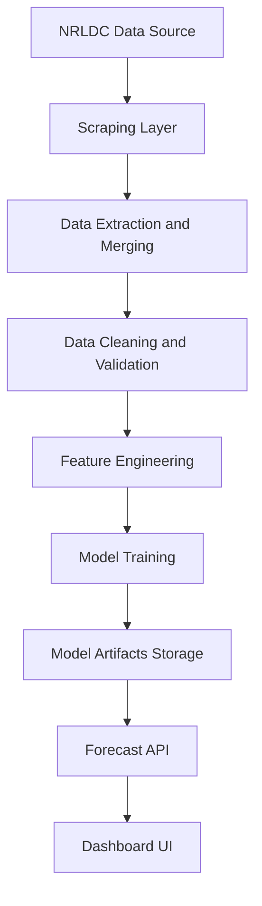
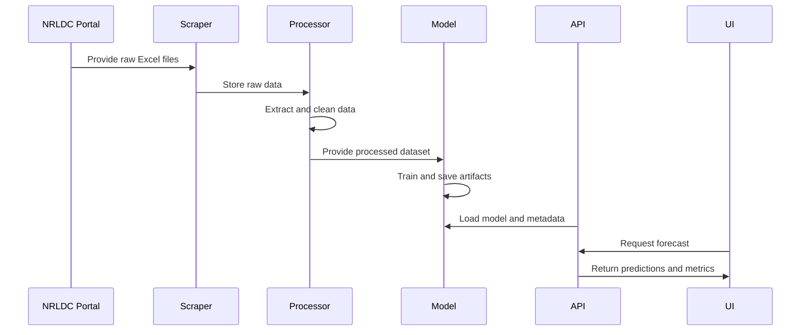

# System Design

## Overview

GridCast is designed as a modular, end-to-end forecasting system for electricity demand prediction. The architecture follows a pipeline-based approach, ensuring:

- Scalability
- Maintainability
- Clear separation of concerns
- Production readiness

The system transforms raw government data into actionable forecasts through structured processing stages.

---

## Design Goals

- End-to-end data pipeline (raw to prediction to visualization)
- Reliable handling of real-world noisy data
- Low-latency forecast serving
- Modular components for easy extension
- Observability through diagnostics (residual analysis)

---

## High-Level Architecture



---

## System Components

### 1. Data Ingestion Layer

Module: src/scrapping/scrap_excel.py

Responsibilities:

- Automates download of electricity data from NRLDC portal
- Handles pagination and dynamic web elements
- Organizes raw files by year and month

Output:

- data/raw/<year>/<month>/*.xlsx

---

### 2. Data Processing Layer

#### Extraction and Merging

Module: src/ingestion/data_merger.py

- Parses Excel files
- Extracts relevant columns (timestamp, demand)
- Merges multiple files into a unified dataset

Output:

- data/extracted/nrldc_extracted.parquet

#### Data Cleaning and Validation

Module: src/ingestion/data_cleaning.py

- Detects anomalies (spikes, unrealistic values)
- Handles missing values
- Applies interpolation
- Ensures time-series consistency

Output:

- data/cleaned/nrldc_cleaned.parquet

---

### 3. Feature Engineering Layer

Module: src/pipeline/train_and_save.py

Transforms raw time-series into model-ready features:

- Lag features (previous time steps)
- Rolling statistics (mean, std)
- Calendar features (hour, day, seasonality)

This converts time-series into a structured learning problem.

---

### 4. Model Training Layer

Module: src/pipeline/train_and_save.py

- Model: XGBoost Regressor
- Training strategy: Time-aware split (last months as holdout)
- Evaluation metrics: MAE, RMSE, MAPE

---

### 5. Model Artifact Layer

Stores trained model and metadata:

```text
data/model/
├── xgboost_model.joblib
├── buffer.json
```

buffer.json contains:

- Feature configuration
- Model metrics
- Rolling buffer (recent data)
- Residual heatmap

This enables reproducible and stateless serving.

---

### 6. Forecast Serving Layer

Module: src/api/app.py

Provides REST API endpoints:

- /health -> model status
- /forecast -> 24-hour prediction
- /residuals -> error heatmap

Key features:

- Loads model once at startup
- Fast inference
- JSON-based responses

---

### 7. Visualization Layer

Module: src/Frontend/dashboard.html

- Displays forecast trends
- Shows KPIs and metrics
- Visualizes residual heatmap
- Enables CSV export

Designed for operational users.

---

## Detailed Data Flow



---

## Data Contracts

### Extracted Data

Columns:

- date
- timestamp
- actual_demand_mw

### Cleaned Data

Index:

- datetime

Columns:

- actual_demand_mw

### Model Output

Forecast:

- datetime
- predicted_load_mw

---

## Design Decisions

### 1. Pipeline-Based Architecture

- Ensures modularity
- Enables independent debugging

### 2. Feature-Based Modeling

- Converts time-series to tabular format
- Allows use of efficient models (XGBoost)

### 3. Artifact-Based Serving

- No retraining required during inference
- Improves reliability and latency

### 4. Residual Diagnostics

- Heatmap identifies error patterns
- Supports operational decision-making

---

## Constraints

- Scraper depends on portal structure stability
- Single-region implementation (currently)
- No real-time streaming (batch-based pipeline)

---

## Future Enhancements

- Real-time data streaming (Kafka or APIs)
- Multi-region support
- Hybrid models (LSTM plus XGBoost)
- Automated retraining pipeline
- Monitoring and alerting system

---

## Summary

GridCast is designed as a production-oriented energy forecasting system that integrates:

- Real-world data ingestion
- Robust preprocessing
- Machine learning modeling
- API-based serving
- Dashboard visualization

The system emphasizes reliability, modularity, and real-world applicability over isolated model performance.
