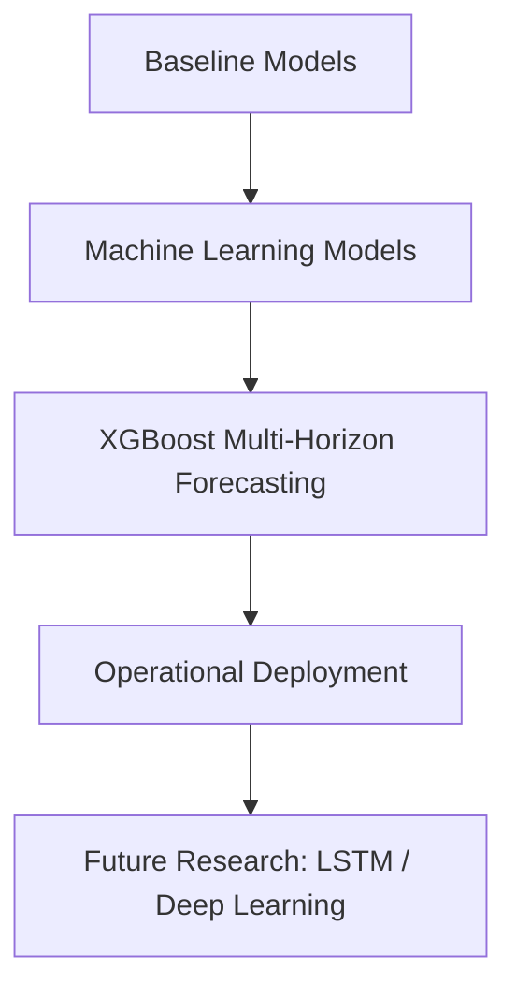

# Smart Grid Electricity Load Forecasting (NRLDC)

## Overview

Electricity load forecasting is a critical task for smart grid operation and power system management. Accurate demand prediction enables grid operators to plan generation schedules, maintain grid stability, and reduce operational costs.

This research evaluates three forecasting approaches for short-term electricity demand prediction using 15-minute interval data from the NRLDC power grid:

- Naive Baseline Model
- XGBoost (Extreme Gradient Boosting)
- LSTM (Long Short-Term Memory Neural Network)

Objective:

- Understand model concepts
- Analyze strengths and weaknesses
- Identify widely used models in practice
- Determine the most suitable model for Smart Grid Load Prediction

---

## 1. Naive Baseline Model

### Concept

The Naive Baseline Model assumes the next observation equals the most recent observed value:

`Load(t+1) = Load(t)`

It does not learn data patterns, and it simply uses the last available observation to forecast the next interval. For 15-minute horizon load, this is a strong baseline because demand changes gradually at this scale.

### Baseline Performance

- Naive Baseline: MAE = 758.60, RMSE = 951.16
- Seasonal Naive Baseline: MAE = 1759.93, RMSE = 2719.94

### Key Insights

- Naive baseline works well short-term due to demand continuity.
- Seasonal naive model is weaker, as demand does not repeat exactly daily (temperature, weekday effects, industrial cycles, operational conditions).

### Strengths

- Simple implementation
- No training
- Fast inference
- Baseline benchmark

### Weaknesses

- Cannot learn trends or relationships
- Ignores nonlinearity
- Poor for longer horizons
- No seasonality or demand drivers handled

---

## 2. XGBoost Model

### Concept

XGBoost is a gradient-boosted decision tree model building trees sequentially, where each tree corrects errors of the previous.

### Feature Engineering

- Lag features (t-1, t-2, t-96)
- Rolling mean, std, moving averages
- Calendar features: hour of day, day of week, month, weekend

These features capture short-term continuity and daily/weekly cycles.

### Forecasting Strategy

Recursive multi-step forecasting:

1. predict next step
2. use prediction as input
3. continue for horizon (24/48/72h)

### Performance

- 24h ahead: MAE 924.88, RMSE 1245.32, MAPE 1.69%
- 48h ahead: MAE 1148.29, RMSE 1472.01, MAPE 2.11%
- 72h ahead: MAE 1523.27, RMSE 1942.15, MAPE 2.74%

Errors grow with horizon due to recursion, but <3% MAPE at 72h indicates strong generalization.

### Strengths

- High accuracy on tabular data
- Nonlinear relationships
- Robust to noise/missing data
- Computationally efficient and scalable

### Weaknesses

- Requires feature engineering
- No inherent sequential modeling
- Recursion accumulates error

---

## 3. LSTM Model

### Concept

LSTM is a recurrent network that retains temporal information with forget/input/output gates. It is designed for sequential dependencies and long-term memory.

### Current Status

LSTM is under development and will be evaluated against XGBoost for potential improvements.

### Strengths

- Good for time-series and long dependencies
- Learns patterns automatically
- Reduced manual feature engineering

### Weaknesses

- Computationally expensive
- Needs larger training data
- Longer training time
- Complex tuning

---

## Practice Comparison and Recommendation

### Widely Used in Production

- XGBoost / gradient boosting is widely adopted in real-world energy forecasting for accuracy, speed, and deployment reliability.

### Academic and Research Trends

- LSTM and deep learning are explored for complex temporal patterns, needing more compute and data.

### Model Comparison

| Model          | Type             | Pattern Learning     | Complexity | Training Required |
| -------------- | ---------------- | -------------------- | ---------- | ----------------- |
| Naive Baseline | Statistical      | None                 | Very Low   | No                |
| XGBoost        | Machine Learning | Nonlinear            | Medium     | Yes               |
| LSTM           | Deep Learning    | Temporal + long-term | High       | Yes               |

### Suitability for NRLDC Smart Grid

- Naive Baseline: benchmark reference
- XGBoost: primary operational model (high accuracy + stable across horizons + nonlinearity) ~1.7% MAPE for 24h
- LSTM: future research candidate for deeper temporal capture

Final decision: XGBoost is recommended as the main model, with LSTM as a future improvement.

---

## Development Pipeline

