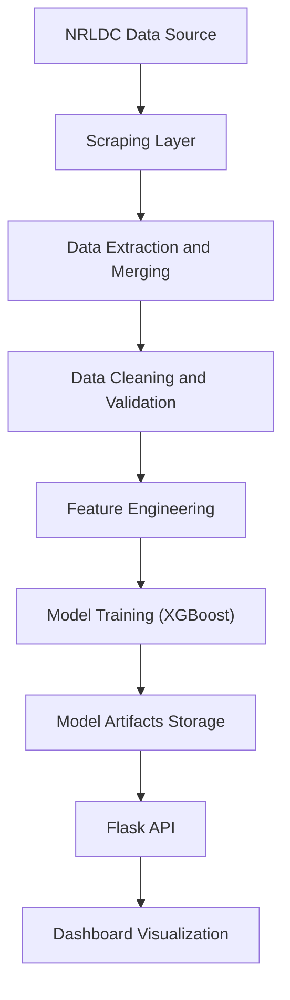

# Project Overview

## Introduction

GridCast is a production-oriented electricity load forecasting system designed for smart grid environments. It combines a robust data engineering pipeline with machine learning-based forecasting and a lightweight serving layer to enable reliable, short-term energy demand prediction.

The system is built to bridge the gap between research-grade forecasting models and real-world operational deployment, with a strong focus on data reliability, reproducibility, and decision support.

---

## Problem Context

Modern power grids must continuously balance electricity supply and demand under dynamic and uncertain conditions, including:

- Intraday consumption variability
- Renewable energy fluctuations
- Peak load stress conditions
- Data inconsistencies (missing values, spikes, irregular records)

Traditional or static forecasting approaches struggle to adapt to these variations, leading to:

- Inefficient energy dispatch
- Increased operational cost
- Reduced grid reliability
- Poor peak demand handling

---

## Solution Overview

GridCast provides an end-to-end forecasting system that:

1. Collects real-world electricity demand data from government sources (NRLDC)
2. Processes and cleans raw time-series data
3. Trains a machine learning model (XGBoost) with engineered temporal features
4. Generates 24-hour ahead forecasts (96 steps at 15-minute intervals)
5. Serves predictions via API
6. Visualizes insights through an operational dashboard

---

## Key Capabilities

- Automated data ingestion from NRLDC portal
- Domain-aware data cleaning and anomaly handling
- Feature-engineered time-series modeling
- 24-hour ahead load forecasting (15-minute granularity)
- REST API for forecast serving
- Residual heatmap for reliability analysis
- Interactive dashboard for operational monitoring

---

## Modeling Approach

The system uses a feature-based autoregressive forecasting approach:

- Model: XGBoost Regressor
- Features:
	- Lag features (historical demand)
	- Rolling statistics
	- Calendar features (hour, day, seasonality)
- Validation:
	- Season-aware holdout (last 3 months)
- Forecasting:
	- Iterative multi-step prediction (96 steps)

This approach ensures:

- Fast inference
- High interpretability
- Stability in production environments

---

## System Workflow

---

## Output and Deliverables

- 24-hour electricity demand forecast
- Residual heatmap (day x hour error patterns)
- Model artifacts (joblib + metadata buffer)
- API endpoints for integration
- Dashboard for visualization

---

## Research Alignment

This project is inspired by research such as:

- IntDEM: Intelligent Deep Optimized Energy Management for IoT-enabled Smart Grid Applications

While such research focuses on improving prediction accuracy using advanced deep learning models on static datasets, GridCast extends this direction by:

- Integrating real-world government data pipelines
- Emphasizing data engineering and system reliability
- Enabling deployment-ready forecasting workflows

---

## Positioning

| Aspect | Research Systems (e.g., IntDEM) | GridCast |
|---|---|---|
| Data | Static datasets | Real-world government data |
| Focus | Model accuracy | End-to-end system |
| Deployment | Simulation | Practical pipeline |
| Usability | Research | Operations-ready |

---

## Strategic Value

GridCast enables:

- Better energy demand planning
- Improved peak load handling
- Reduced operational inefficiencies
- Scalable foundation for smart grid intelligence

---

## Vision

To evolve into a real-time intelligent energy platform that integrates:

- Live data streams
- Advanced ML and DL models
- LSTM deep learning models for improved forecasting accuracy
- Multi-region forecasting
- Smart grid optimization

---

## Summary

GridCast is not just a forecasting model. It is a production-ready energy intelligence system designed to bring real-world applicability to smart grid forecasting.
