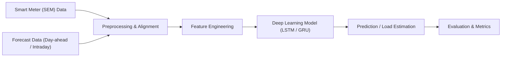

# Smart Grid Load Prediction Using Deep Learning

AI-driven system for predicting electricity demand using smart meter data and intraday forecast signals to improve grid stability and demand planning.

---

## Overview

This project presents a deep learning–based smart grid forecasting system designed to predict electricity load accurately by integrating smart meter data and official forecast signals. The system learns temporal demand patterns, corrects forecasting errors, and generates reliable load predictions that support efficient grid management and energy planning.

The solution combines time-series modeling, feature engineering, and neural networks to create a scalable AI pipeline suitable for real-world power system applications.

---

## Problem Statement

Modern power grids experience instability due to dynamic electricity demand fluctuations. Traditional static forecasting systems fail to capture nonlinear trends, peak demand spikes, and real-time consumption patterns, leading to inefficiencies such as inaccurate load estimation, supply–demand imbalance, energy wastage, and grid overload risks.

An intelligent prediction system is required to enhance forecasting accuracy and support smart grid decision-making.

---

## Objectives

- Understand power system data analytics using real grid datasets
- Apply deep learning regression techniques for time-series prediction
- Design a scalable AI-based system architecture
- Improve forecasting accuracy through hybrid modeling
- Analyze sustainability and efficiency impact

---

## System Architecture



### Architecture Layers

1. Data Input Layer — SEM and forecast data ingestion
2. Preprocessing Layer — cleaning, resampling, and alignment
3. Feature Engineering — lag, rolling statistics, and calendar features
4. Model Layer — LSTM/GRU neural network for sequence forecasting
5. Prediction Layer — generate load estimates for required horizons
6. Evaluation Layer — compute performance metrics and visualizations

---

## Workflow Pipeline

1. Data Collection
2. Preprocessing
3. Feature Engineering
4. Model Training
5. Prediction
6. Evaluation

---

## Dataset Description

### SEM Processed Data

Contains:

- time-stamped load measurements (typically 15-minute intervals)
- used as the target variable and for generating lag features

### Intraday Forecast Data

Contains:

- day-ahead and intraday forecast values
- used as predictive signals and baselines for error-correction modeling

---

## Features

Typical features used during modeling:

- `timestamp`
- `actual_load`
- `intraday_forecast`
- `day_ahead_forecast`
- `hour`
- `day_of_week`
- `lag_1`, `lag_4`
- `rolling_mean_1hr`

These features capture temporal behavior, recent trends, and forecast patterns that influence electricity demand.

---

## Model Architecture

A representative deep learning architecture used in experiments:

- Input Layer
- LSTM (64 units)
- Dropout
- LSTM (32 units)
- Dense Layer
- Output Prediction

### Training Configuration

- Loss: Mean Squared Error (MSE)
- Optimizer: Adam
- Batch Size: 32 (configurable)
- Epochs: configurable

Baseline models used for comparison include Random Forest regressors and simpler persistence models.

---

## Tech Stack

- Python
- Pandas, NumPy
- TensorFlow / Keras
- Scikit-learn
- Matplotlib / Seaborn

---

## Installation

Clone the repository:

```bash
git clone https://github.com/yourusername/smart-grid-load-prediction.git
cd smart-grid-load-prediction
```

Install dependencies:

```bash
pip install -r requirements.txt
```

---

## Usage

Run preprocessing:

```bash
python preprocess.py
```

Train model:

```bash
python train.py
```

Run prediction / inference:

```bash
python predict.py
```

---

## Results and Visualizations

Model evaluation includes predicted vs actual plots, error time-series, and aggregated performance by hour and day. Visual outputs typically include:

- Predicted vs actual graphs
- Error distribution plots
- Trend comparison and peak analysis

---

## Evaluation Metrics

Performance is measured using:

- RMSE — Root Mean Square Error
- MAE — Mean Absolute Error
- MAPE — Mean Absolute Percentage Error
- R² Score

These metrics provide a robust view of forecast accuracy and reliability.

---

## Future Improvements

- Integrate weather and temperature data for improved accuracy
- Deploy a real-time prediction API for operational use
- Add an interactive visualization dashboard for monitoring
- Explore attention-based and transformer models for long-range dependencies
- Scale the system to support multi-region and hierarchical forecasting

---

## References

Add links to datasets, papers, and documentation here. Example format:

```
[1] Research Paper Title — Link
[2] Dataset Source — Link
[3] Official Grid Portal — Link
[4] TensorFlow Documentation — Link
```

---

## Author

Your Name
Data Science & AI

---

## Optional: Key Highlights

- Real smart grid dataset
- Deep learning prediction model
- Multi-source data integration
- Industry-level system architecture
- Forecast correction approach

---

## Final Note

This README follows professional ML repository standards and research project documentation style to present a clear, technical, and production-oriented summary of the project.
