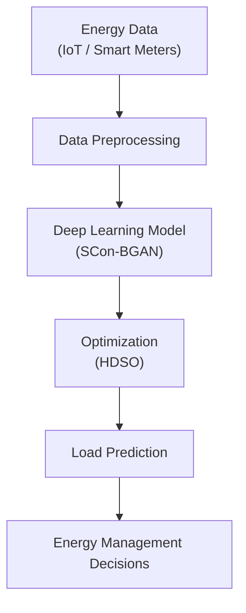

# Base Research - Energy Forecasting and Smart Grid Systems

## Introduction

This project is built upon existing research in the domain of energy demand forecasting, smart grids, and AI-driven energy management systems.

The following paper forms the primary foundation for understanding modern approaches to intelligent energy management.

---

## Reference Paper

Title: IntDEM: Intelligent Deep Optimized Energy Management System for IoT-enabled Smart Grid Applications  
Domain: Smart Grids, Energy Forecasting, Deep Learning  
Link: https://link.springer.com/article/10.1007/s00202-024-02586-3

---

## Problem Addressed in Literature

The paper focuses on improving energy demand forecasting accuracy in smart grid systems.

Key challenges identified:

- Increasing electricity demand due to urbanization
- Energy wastage due to poor demand estimation
- Difficulty in balancing supply and demand
- Inefficiency of traditional forecasting methods

Accurate load prediction is essential for:

- Efficient energy distribution
- Cost optimization
- Grid stability

---

## Proposed Solution (IntDEM Framework)

The paper proposes an AI-based system called IntDEM, which combines:

### 1. Data Processing Layer

- Input: Energy consumption data (from smart meters / IoT systems)
- Preprocessing:
	- Missing value handling
	- Noise removal
	- Normalization

---

### 2. Deep Learning Model - SCon-BGAN

A hybrid architecture combining:

- 1D Convolutional Neural Network (CNN)
	- Extracts patterns from energy usage data
- Bi-Directional GRU (Bi-GRU)
	- Captures time-based dependencies
- Attention Mechanism
	- Focuses on the most relevant features

Purpose: Improve prediction accuracy by capturing both spatial and temporal patterns.

---

### 3. Optimization Technique - HDSO

Hybrid Darts Seagull Optimizer used for:

- Learning rate tuning
- Parameter optimization
- Faster convergence

Purpose: Reduce prediction error and improve model efficiency.

---

## System Workflow (Conceptual)

---

## Datasets Used in the Paper

The model is evaluated using historical benchmark datasets:

- ISO-NE (USA grid data)
- SGSC (Australia smart grid data)
- IHEPC (France household data)

These datasets are:

- Pre-collected
- Cleaned
- Static (not real-time)

---

## Key Findings

- Significant improvement in prediction accuracy
- Reduction in forecasting error
- Better performance compared to traditional ML and DL models

This demonstrates the effectiveness of hybrid deep learning plus optimization.

---

## Limitations Identified

Despite strong modeling performance, the paper has practical limitations:

- Uses static datasets, not real-time data
- No integration with live data pipelines
- Limited focus on deployment and system design
- Does not address data ingestion challenges in real-world systems

---

## Research Gap

The key gap identified from the paper:

Existing approaches focus on improving prediction models but do not address real-world data integration and deployment challenges.

Specifically:

- Lack of real-time data ingestion
- No region-specific implementation
- Limited focus on system scalability and usability

---

## Relevance to Our Project

This project extends the direction of IntDEM by:

- Integrating real-world government data (NRLDC)
- Handling raw and noisy data pipelines
- Building a complete end-to-end system
- Providing region-specific forecasting

---

## Comparison with Our Approach

| Aspect | IntDEM (Research) | Our System (GridCast) |
|---|---|---|
| Data Source | Static datasets | Real-time government data |
| Focus | Model accuracy | End-to-end pipeline |
| Deployment | Simulation | Practical system |
| Data Handling | Preprocessed | Raw to cleaned pipeline |
| Usability | Research-level | Operations-ready |

---

## Key Insight

IntDEM demonstrates how to build a powerful prediction model, while our system focuses on making such systems usable in real-world environments through reliable data pipelines and deployment-ready architecture.

---

## Conclusion

The IntDEM paper provides a strong theoretical foundation for AI-based energy forecasting. However, real-world systems require:

- Reliable data ingestion
- Robust preprocessing pipelines
- Deployment-ready architecture

This project bridges that gap by combining research insights with practical system design.
