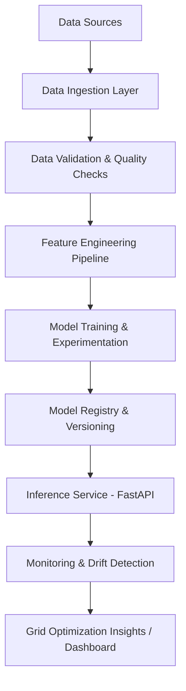

# Smart Grid Load Forecasting System – Design Document

## 1. Overview

Electric power grids operate under continuously changing demand patterns influenced by human behavior, weather conditions, and economic activity. Inaccurate or static forecasting can lead to grid instability, blackouts, inefficient energy dispatch, and increased carbon emissions.

This project designs and implements a **production-grade Smart Grid Load Forecasting System** using modern machine learning and deep learning techniques. The system predicts short-term and medium-term electricity demand and provides actionable insights for grid optimization and sustainability-aware decision-making.

---

## 2. Problem Statement

Design a scalable AI-driven system that forecasts electricity load at multiple time horizons (15-minute, 1-hour, 24-hour ahead) using historical grid data and external signals, enabling proactive grid management, peak-load mitigation, and reduced reliance on carbon-intensive energy sources.

---

## 3. Objectives

* Understand and apply power system data analytics
* Build robust time-series forecasting models using ML and DL
* Design an end-to-end, production-oriented ML system
* Evaluate system performance using industry-relevant metrics
* Analyze sustainability and grid stability impact

---

## 4. System Architecture (High-Level)

---

## 5. Data Sources

### 5.1 Primary Dataset

* **Electricity Load Diagrams Dataset (UCI Repository)**

  * 15-minute interval electricity consumption
  * Real-world smart meter data

### 5.2 External / Exogenous Data (Optional but Recommended)

* Weather data (temperature, humidity)
* Calendar data (weekends, holidays, seasonal indicators)

---

## 6. Data Engineering Pipeline

### 6.1 Data Ingestion

* Load raw CSV / API data
* Normalize timestamps to a consistent frequency

### 6.2 Data Validation

* Missing timestamp detection
* Outlier and spike detection (sensor faults)
* Non-physical values (negative or zero load)

### 6.3 Feature Engineering

| Feature Category   | Examples                   |
| ------------------ | -------------------------- |
| Lag Features       | Load t-1, t-4, t-96        |
| Rolling Statistics | 1-hour mean, 24-hour std   |
| Temporal Encoding  | Hour, day, month (sin/cos) |
| Exogenous          | Temperature, holiday flag  |

---

## 7. Modeling Strategy

### 7.1 Baseline Models (Mandatory)

* Naive persistence model
* Moving average
* Linear regression
* Tree-based models (XGBoost / LightGBM)

Purpose: establish minimum acceptable performance and sanity check data quality.

### 7.2 Deep Learning Models

* **LSTM**: captures sequential dependencies in load patterns
* **GRU**: computationally efficient alternative
* *(Optional)* Temporal CNN / Transformer for long-horizon forecasting

---

## 8. Training & Evaluation

### 8.1 Data Splitting

* Time-based split only

  * Train: historical period
  * Validation: recent past
  * Test: most recent unseen data

### 8.2 Evaluation Metrics

| Metric          | Justification                |
| --------------- | ---------------------------- |
| MAE             | Interpretable absolute error |
| RMSE            | Penalizes peak errors        |
| MAPE            | Relative performance         |
| Peak Load Error | Grid stability relevance     |

---

## 9. Sustainability & Grid Impact Analysis

The system evaluates forecast improvements specifically during peak demand periods. Reduced prediction error enables:

* Better renewable energy scheduling
* Reduced emergency thermal plant usage
* Lower carbon emissions

Example analysis:

> A reduction in peak forecasting error can significantly decrease reliance on fossil-fuel-based peaking plants.

---

## 10. Optimization & Decision Support Layer

A rule-based simulation layer uses predicted load to:

* Trigger demand-response signals
* Shift non-critical loads
* Allocate stored renewable energy

This layer demonstrates how ML outputs translate into operational grid decisions.

---

## 11. Deployment Strategy

### 11.1 Inference Service

* REST API using **FastAPI**
* Endpoint: `/predict-load`

### 11.2 Model Registry

* Versioned models with metadata:

  * Training date
  * Metrics
  * Feature set

### 11.3 Monitoring

* Prediction error tracking
* Data drift detection
* Automated retraining triggers

---

## 12. Project Deliverables

* End-to-end ML pipeline codebase
* Trained forecasting models
* Inference API service
* System architecture documentation
* Sustainability impact report

---

## 13. Repository File Name Recommendation

**Filename:** `SMART_GRID_LOAD_FORECASTING_SYSTEM_DESIGN.md`

This document serves as the foundational design and system specification for the project and can be directly included in the project repository.

---

## 14. Conclusion

This project demonstrates how deep learning, when combined with strong data engineering and system design principles, can solve real-world energy challenges. The resulting system aligns with industry-grade ML practices and highlights the role of AI in enabling stable, efficient, and sustainable power grids.
